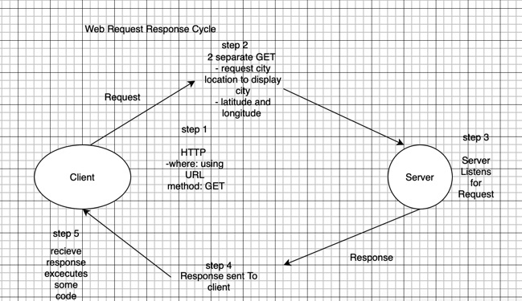

# Project Name

**Author**: CoderMichelle
**Version**: 1.0.0 (increment the patch/fix version number if you make more commits past your first submission)

## Overview
The app allows a user to type in a city and look up information and display it.
<!-- Provide a high level overview of what this application is and why you are building it, beyond the fact that it's an assignment for this class. (i.e. What's your problem domain?) -->

## Getting Started
<!-- What are the steps that a user must take in order to build this app on their own machine and get it running? -->

## Architecture
This reaches out to outside servers using multiple API calls.
<!-- Provide a detailed description of the application design. What technologies (languages, libraries, etc) you're using, and any other relevant design information. -->

## Change Log
<!-- Use this area to document the iterative changes made to your application as each feature is successfully implemented. Use time stamps. Here's an example:

01-01-2001 4:59pm - Application now has a fully-functional express server, with a GET route for the location resource. -->

## Credit and Collaborations
<!-- Give credit (and a link) to other people or resources that helped you build this application. -->

Name of feature: Whiteboard
Estimate of time needed to complete: 15min
Start time: 9pm
Finish time: 9:30pm 
Actual time needed to complete: 20min

Name of feature: Map,Long/Lat,API call
Estimate of time needed to complete: 2.5hrs
Start time: 5:30pm
Finish time: 11:00pm
Actual time needed to complete: 4.0hrs

Name of feature:
Estimate of time needed to complete: 
Start time: 
Finish time: 
Actual time needed to complete:

